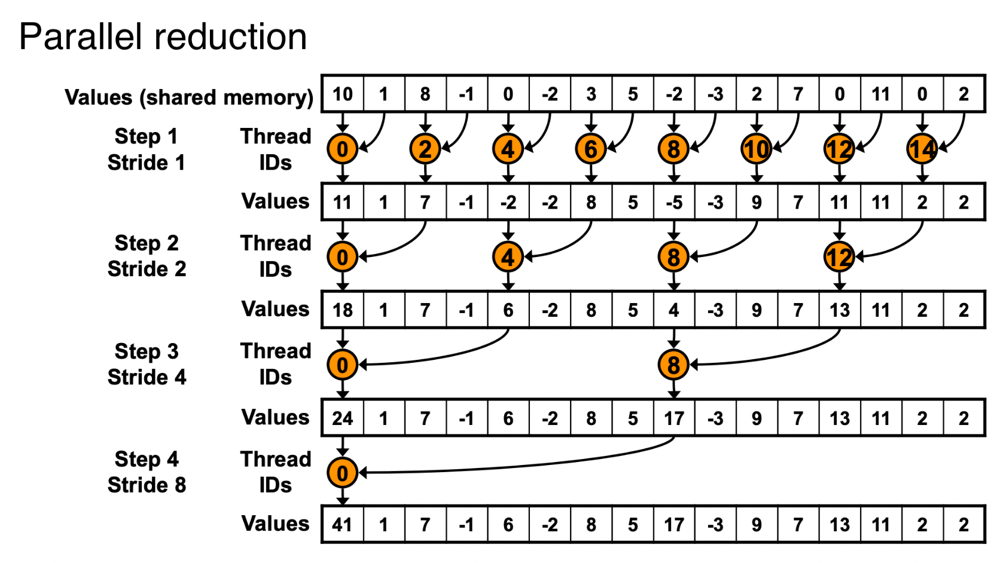
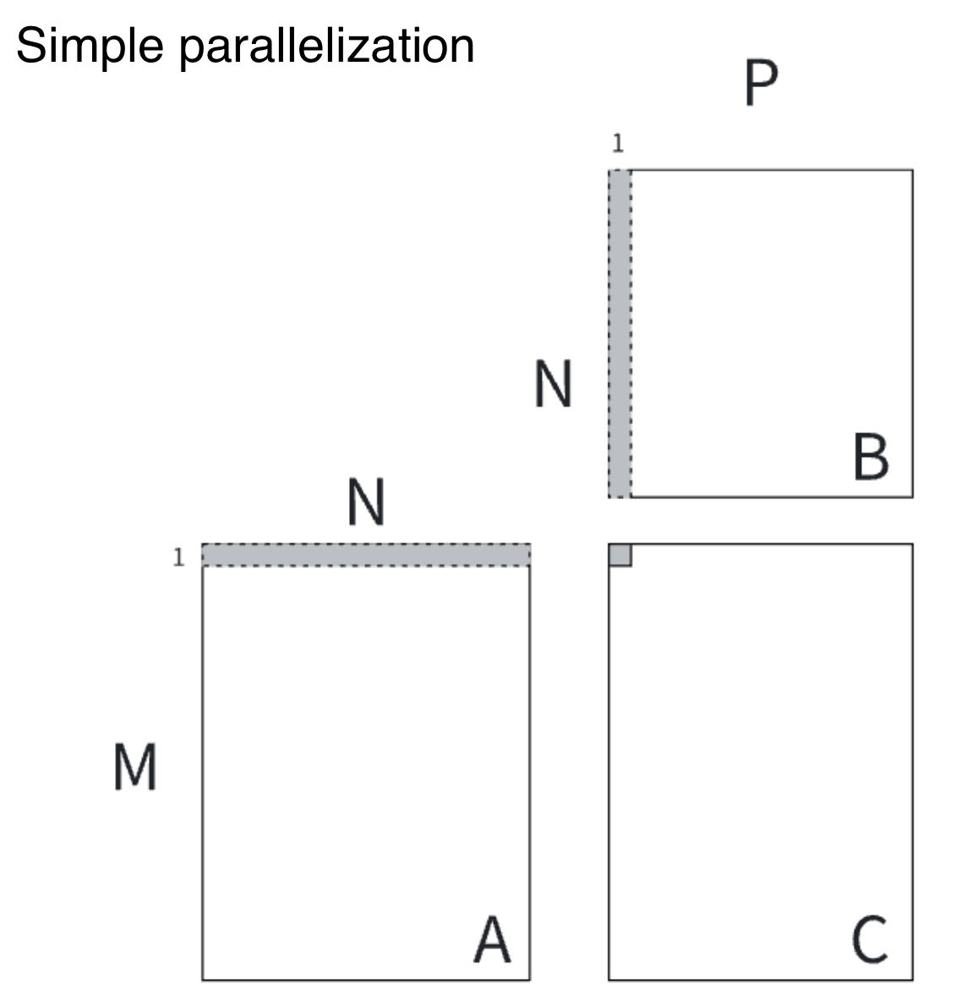
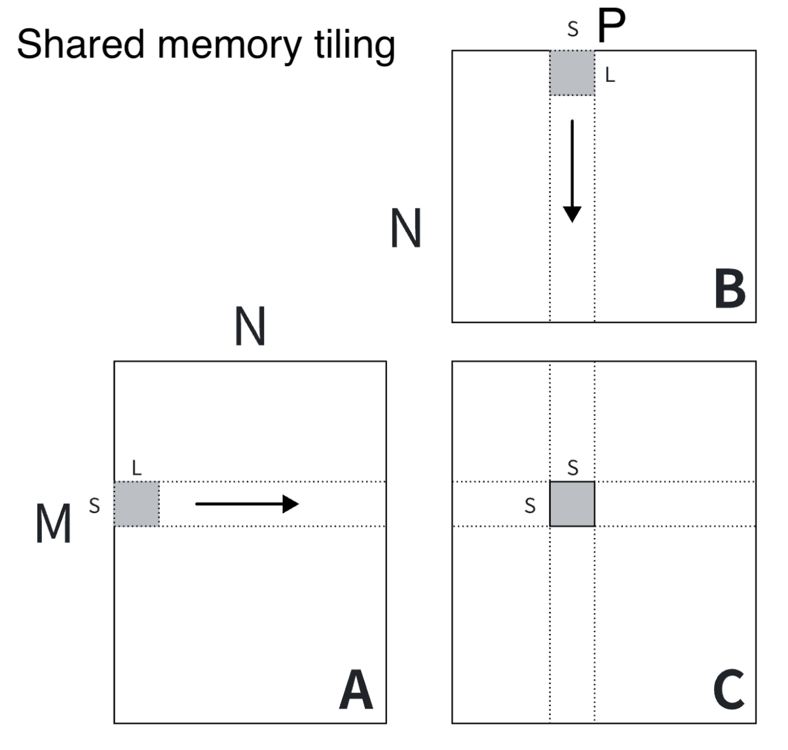

# Assignment 1: CUDA Programming

The goal of this assignment is to implement high-performance CUDA kernels for tensor operations and integrate them with the MiniTorch framework. You will implement low-level operators in CUDA C++ and connect them to Python through the CUDA backend. This assignment focuses on parallel computing concepts and GPU acceleration techniques.

## Environment Setup

The starting code base is provided in [llmsystem/llmsys_f25_hw1.git](https://github.com/llmsystem/llmsys_f25_hw1.git).

**Prerequisites:** You'll need a GPU to complete this assignment. We recommend Google Colab, which is free and similar to Jupyter Notebooks, and allows you to run on a GPU. You are also welcome to use AWS credits and PSC accounts to access Virtual Machines with more advanced GPU, which will be signed up later, but not necessary.

Please check your version of Python (Python 3.12+), run either:

```bash
python --version
python3 --version
```

We also highly recommend setting up a virtual environment. The virtual environment lets you install packages that are only used for your assignments and do not impact the rest of the system. We suggest venv or anaconda.

For example, if you choose venv, run the following command:

```bash
python -m venv venv
source venv/bin/activate
```

Then clone the starter codes from the git repo and install packages.

```bash
git clone https://github.com/llmsystem/llmsys_f25_hw1.git
cd llmsys_f25_hw1
# If you are using PSC, 
# please load the CUDA module before installing packages:
# module load cuda/12.6.0
python -m pip install -r requirements.txt
python -m pip install -Ue .
```

Make sure that everything is installed by running the following command:

```bash
python -c "import minitorch; print('Success: minitorch is installed correctly');" 2>/dev/null || echo "Error: Failed to import minitorch. Please check your installation."
```

Create a directory for compiled cuda_kernels.

```bash
mkdir minitorch/cuda_kernels
```

## Code files layout

```
minitorch/                  # The minitorch source code
    cuda_kernel_ops.py      # Connects Tensor backend with the CUDA kernels
                              (integrated with each problem)
src/
    combine.cu              # CUDA kernels implementation (Problems 1-4)
```

## Problem 1: Map Operation CUDA Kernel + Integration (15 points)

Implement the CUDA kernel for element-wise map operations and integrate it with the MiniTorch framework. The map operation applies a unary function to every element of an input tensor, producing a new tensor with the same shape. For example, applying `f(x) = x²` to tensor `[1, 2, 3]` yields `[1, 4, 9]`. 

**Note**: Be sure to check out the CUDA examples in [lecture 3 slides](https://llmsystem.github.io/llmsystem2025spring/assets/files/llmsys-03-gpu-programming2-4075ed5f62b3601db6bbe1991e5980c0.pdf) and the [cuda accelaration examples](https://github.com/llmsystem/llmsys_code_examples/tree/main/cuda_acceleration_demo)!

The places where you need to fill in your code are highlighted with `BEGIN ASSIGN2_1` and `END ASSIGN2_1`

Implement the CUDA kernel for map operations in `src/combine.cu`. The map operation applies a function element-wise to a tensor.

```cpp
__global__ void mapKernel(scalar_t* out, ...){
    ...
}
```

### Hints

- Each thread should process one element of the output tensor
- Use thread and block indices to calculate the global thread ID
- Ensure proper bounds checking to avoid out-of-bounds memory access
- Consider the stride-based indexing for multidimensional tensors

### Data layout and strides

To represent multidimensional tensor in memory, we use strides format. To represent a 2D matrix in 1D array, we usually use row major representation, `A[i, j] = Adata[i * cols + j]`.

While for strides format, `A[i, j] = Adata[i * strides[0] + j * strides[1]]`. For example:

```cpp
Adata = [1, 2, 3, 4, 5, 6, 7, 8]
A = [[1, 2, 3, 4], [5, 6, 7, 8]]
# To access (1, 2)
# Row major format
rows, cols = 2, 4
A[1][2] == Adata[1 * cols + 2]
# Strides format
strides = (4, 1)
A[1][2] = Adata[1 * strides[0] + 2 * strides[1]]
```

### Testing and Compilation

1. **Recompile CUDA kernels** after implementing the kernel:

   **Note**: Every time you make changes to the `combine.cu`, you need to compile it again.

   ```bash
   nvcc -o minitorch/cuda_kernels/combine.so --shared src/combine.cu -Xcompiler -fPIC
   ```

2. **Test your implementation**:

   ```bash
   python -m pytest -l -v -k "cuda_one_args"    # for map
   ```

   You may encounter *Fatal Error*, it means your cuda implementation is buggy. 
   You could try to debug your code by adding print statements to your cuda code to print the values of the intermediate variables.

## Problem 2: Zip Operation CUDA Kernel + Integration (25 points)

Implement the CUDA kernel for element-wise zip operations and integrate it with the framework. This operation applies a binary function to corresponding elements from two input tensors, producing a new tensor with the same shape. For example, applying addition `f(x,y) = x + y` to tensors `[1, 2, 3]` and `[4, 5, 6]` yields `[5, 7, 9]`. 

### Part A: Implement zipKernel (20 points)

The places where you need to fill in your code are highlighted with `BEGIN ASSIGN2_2` and `END ASSIGN2_2`

Implement the CUDA kernel for zip operations in `src/combine.cu`. The zip operation applies a binary function to corresponding elements of two input tensors.

```cpp
__global__ void zipKernel(scalar_t* out, ...){
    ...
}
```

#### Hints

- Each thread processes one element from each input tensor
- Both input tensors should have the same shape or be broadcastable
- Handle stride-based indexing for both input tensors
- Ensure proper bounds checking

### Part B: Integrate Zip Operation (5 points)

The places where you need to fill in your code are highlighted with `BEGIN ASSIGN2_2_INTEGRATION` and `END ASSIGN2_2_INTEGRATION`

Implement the `zip` function in `minitorch/cuda_kernel_ops.py`:

```python
class CudaKernelOps(TensorOps):
    @staticmethod
    def zip(fn: Callable[[float, float], float]) -> Callable[[Tensor, Tensor], Tensor]:
        ...
```

### Testing and Compilation

1. **Recompile and test**:

   ```bash
   nvcc -o minitorch/cuda_kernels/combine.so --shared src/combine.cu -Xcompiler -fPIC
   python -m pytest -l -v -k "cuda_two_args"    # for zip
   ```

## Problem 3: Reduce Operation CUDA Kernel + Integration (25 points)

Implement the CUDA kernel for reduction operations and integrate it with the framework. This operation aggregates elements along a specified dimension of a tensor using a binary function, producing a tensor with reduced dimensionality. For example, reducing tensor `[[1, 2, 3], [4, 5, 6]]` along dimension 1 with sum yields `[6, 15]`.

### Part A: Implement reduceKernel (20 points)

The places where you need to fill in your code are highlighted with `BEGIN ASSIGN2_3` and `END ASSIGN2_3`

Implement the CUDA kernel for reduce operations in `src/combine.cu`. The reduce operation combines elements along a specified dimension.

```cpp
__global__ void reduceKernel(scalar_t* out, ...){
    ...
}
```

#### Hints - Basic Reduction

A simple way to parallel the reduce function is to have every reduced element in the output calculated individually in each block. The basic idea of ReduceSum is shown in Figure 1. In each block, it is important to think about how to calculate the step across the data to be reduced based on `reduce_dim` and `strides`.

<figure markdown="span">  <figcaption>Figure 1: Basic idea of reduce add function.</figcaption> </figure>

#### Hints - Optimized Reduction (Optional)

You can also try optimizing the parallelization for a single reduce operation. Threads inside the block first load the data to a shared memory space, then perform parallel reduction with a tree-based method, as is shown in Figure 2. This is a simple optimized version for ReduceSum<sup>1</sup>. In our implementation, you need to think over how to apply the paradigm to ReduceMultiply and ReduceMax as well. You have to also carefully consider how to apply the reduction over certain axis as we are operating a multidimensional tensor represented as a contiguous array. Calculating the positions with helper functions `to_index` and `index_to_position` is necessary. We provide the pseudocode here for you.

```cpp
__global__ void reduce0(int *g_idata, int *g_odata) {
    __shared__ int sdata[];
    int pos = threadIdx.x;
    int i = blockIdx.x * blockDim.x + threadIdx.x;
    sdata[tid] = g_idata[i];
    __syncthreads();
    for(int s = 1; s < blockDim.x; s *= 2) {
        if (tid % (2 * s) == 0) {
            sdata[tid] += sdata[tid+s];
        }
        __syncthreads();
    }
    if (tid == 0) {
        g_odata[blockIdx.x] = sdata[0];
    }
}
```

<figure markdown="span"> {width="600"} <figcaption>Figure 2: Reduction<sup>1</sup>.</figcaption> </figure>

### Part B: Integrate Reduce Operation (5 points)

The places where you need to fill in your code are highlighted with `BEGIN ASSIGN2_3_INTEGRATION` and `END ASSIGN2_3_INTEGRATION`

Implement the `reduce` function in `minitorch/cuda_kernel_ops.py`:

```python
class CudaKernelOps(TensorOps):
    @staticmethod
    def reduce(
        fn: Callable[[float, float], float], reduce_value: float = 0.0
    ) -> Callable[[Tensor, int], Tensor]:
        ...
```

### Testing and Compilation

1. **Recompile and test**:

   ```bash
   nvcc -o minitorch/cuda_kernels/combine.so --shared src/combine.cu -Xcompiler -fPIC
   python -m pytest -l -v -k "cuda_reduce" # for reduce
   ```

## Problem 4: Matrix Multiplication CUDA Kernel + Integration (30 points)

Implement the CUDA kernel for matrix multiplication and integrate it with the framework. This is one of the most important operations in deep learning and offers significant opportunities for optimization.

### Part A: Implement MatrixMultiplyKernel (25 points)

The places where you need to fill in your code are highlighted with `BEGIN ASSIGN2_4` and `END ASSIGN2_4`

Implement the CUDA kernel for matrix multiplication in `src/combine.cu`.

```cpp
__global__ void MatrixMultiplyKernel(scalar_t* out, ...) {
    ...
}
```

#### Hints - Simple Parallelization

A simple way to parallel matrix multiplication is to have every element in the output matrix calculated individually in each thread, as is shown in Figure 3. We provide the pseudocode here for you. Refer to Chapter 4.3 Matrix Multiplication in [Programming Massively Parallel Processors, 4th Ed](https://learning.oreilly.com/library/view/programming-massively-parallel/9780323984638/?sso_link=yes&sso_link_from=cmu-edu) for more details.

```cpp
__global__ void mm(float A[N][N], float B[N][N], float C[N][N]) {
    int idx = threadIdx.x + blockIdx.x * blockDim.x;
    int row = idx / N;
    int col = idx % N;
    if (row < N && col < N) {
        float sum = 0.0;
        for (int k = 0; k < N; k++) {
            sum += A[row][k] * B[k][col];
        }
        out[row][col] = sum;
    }
}
```

<figure markdown="span"> {width="300"} <figcaption>Figure 3: Simple parallelization.</figcaption> </figure>

#### Hints - Shared Memory Tiling (Optional)

A more advanced way to accelerate matrix multiplication with shared memory tiling is illustrated in Figure 4. It is resource intensive to only utilize one thread to calculate one element of the output matrix. We can allocate a chunk of output elements for each block, and create threads inside the block to compute the results in parallel. Each block takes care of a chunk of `[S, S]` elements. Each thread inside the block calculates smaller parts of `[Si, L] × [L, Si]`, and accesses the shared memory across the block. We provide the pseudocode here for you. Refer to Chapter 5.4 A Tiled Matrix Multiplication Kernel in [Programming Massively Parallel Processors, 4th Ed](https://learning.oreilly.com/library/view/programming-massively-parallel/9780323984638/?sso_link=yes&sso_link_from=cmu-edu) for more details.

```cpp
__global__ void mm(float A[N][N], float B[N][N], float C[N][N]) {
    __shared__ float sA[S][L], sB[L][S];
    float tC[S][S] = [0];
    int i = blockIdx.x * blockDim.x + threadIdx.x;
    int j = blockIdx.y * blockDim.y + threadIdx.y;
    for (int ks = 0; ks < N; ks += L) {
        sA[:, :] = A[i:i+S, ks:ks+L];
        sB[:, :] = B[i:i+S, ks:ks+L];
        __syncthreads();
        for (int ki = 0; ki < L; ++kk) {
            tC[:] += sA[:][ki] * sB[ki][:];
        }
        __syncthreads();
    }
    C[i][j] = tC[:];
}
```

<figure markdown="span"> {width="300"} <figcaption>Figure 4: Shared memory tiling.</figcaption> </figure>

### Part B: Integrate Matrix Multiplication (5 points)

The places where you need to fill in your code are highlighted with `BEGIN ASSIGN2_4_INTEGRATION` and `END ASSIGN2_4_INTEGRATION`

Implement the `matrix_multiply` function in `minitorch/cuda_kernel_ops.py`:

```python
class CudaKernelOps(TensorOps):
    @staticmethod
    def matrix_multiply(a: Tensor, b: Tensor) -> Tensor:
        ...
```

### Testing and Compilation

1. **Recompile and Test**:

   ```bash
   nvcc -o minitorch/cuda_kernels/combine.so --shared src/combine.cu -Xcompiler -fPIC
   python -m pytest -l -v -k "cuda_matmul" # for matrix multiplication
   ```

## Problem 5: Final Integration Test (5 points)

After correctly implementing all functions, you should be able to pass all CUDA tests:

```bash
python -m pytest -l -v -k "cuda"
```

**Note**: This integration test includes more comprehensive test cases than the individual problem tests. If you pass the previous problem tests but fail here, please review your implementations.


## Submission

Please submit the whole directory `llmsys_f25_hw1` as a zip on canvas. Your code will be automatically compiled and graded with private test cases.

## FAQs

1. **My CUDA code does not pass the testcases even though I believe they are correct, what should I do?** Please make sure you recompile the CUDA kernels every time you make any changes, also, try restarting the Colab kernels if you are using Google Colab to get a fresh start.
2. **I'm getting memory access errors in my CUDA kernels, what should I check?** Common issues include: (1) Not checking thread bounds properly, (2) Incorrect stride calculations, (3) Race conditions in shared memory access. Make sure to add proper bounds checking and use `__syncthreads()` appropriately.
3. **My matrix multiplication kernel is very slow, how can I optimize it?** Consider implementing the tiled version with shared memory. The simple version where each thread computes one output element can be inefficient due to memory access patterns. The tiled version can significantly improve performance by reusing data in shared memory.
4. **How do I debug CUDA kernels?** CUDA debugging can be challenging. Start with simple test cases, add bounds checking, and use `printf` statements in kernels for debugging (though this can affect performance). Also, make sure your host code properly checks for CUDA errors.
5. **I'm having trouble understanding the stride-based indexing, can you explain more?** Strides allow flexible memory layouts for multidimensional arrays. Each dimension has a stride that tells you how many elements to skip to move to the next element in that dimension. Practice with simple 2D examples first, then extend to higher dimensions.
6. **Should I implement the integration part immediately after the kernel?** Yes! This new structure allows you to test your kernel implementation immediately with the Python integration, making testing possible.

------

<sup>1</sup>https://developer.download.nvidia.com/assets/cuda/files/reduction.pdf
